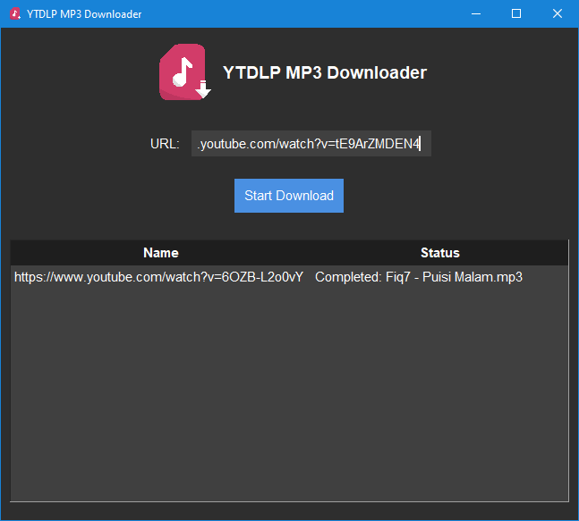

# ytdlp-mp3-downloader

A lightweight YouTube audio downloader built for fast, reliable MP3 export. This project focuses on keeping the experience simple and streamlined while preserving high audio quality and basic track metadata for offline listening.



## Features

- Download audio from YouTube at the best available quality (up to 192 kbps)
- Save files as MP3 with metadata sourced from YouTube and iTunes when available
- Simple command-line interface plus a graphical UI entry point
- Uses `browser-cookie3` to fetch cookies automatically in order: Firefox, Edge, Brave, Opera, Chrome

## Install

The Python requirements should be installed and `ffmpeg` should be available on the system `PATH`.

```bash
git clone https://github.com/Zigatronz/ytdlp-mp3-downloader
cd ytdlp-mp3-downloader
python -m pip install -r requirements.txt
```

Installation can be verified by running `ffmpeg` in a terminal. If `ffmpeg` is not present, download a build from https://ffmpeg.org/download.html and add it to the system `PATH`.

## Usage

### GUI

```bash
python ytdlp-mp3-downloader-gui.py
```

### CLI

```bash
python ytdlp-mp3-downloader-cli.py --url "https://www.youtube.com/watch?v=VIDEO_ID"
```

## Flowchart

For a visual overview of the application's workflow, view the [interactive flowchart](https://app.diagrams.net/?src=about#Uhttps%3A%2F%2Fraw.githubusercontent.com%2FZigatronz%2Fytdlp-mp3-downloader%2Frefs%2Fheads%2Fmain%2Fflowchart.drawio).

## Why this project exists

This tool is created for users who want a lightweight, user-friendly way to save YouTube audio as MP3 without dealing with cookies, complex authentication, or heavy setup.

## License

This project is distributed under the MIT License. You are free to use, modify, and distribute the code with attribution, subject to the terms of the MIT License.
